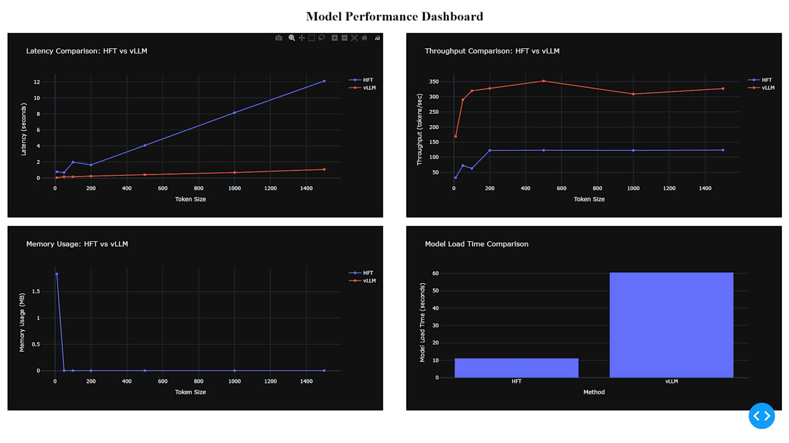

# vLLM vs HFT Inference Performance Comparison

## Overview

This experiment evaluates the inference performance of **vLLM** and **Hugging Face Transformers (HFT)** using the `facebook/opt-125m` model in a Google Colab environment equipped with an NVIDIA T4 GPU. The comparison focuses on four key metrics:

1. Latency
2. Throughput
3. Memory Usage
4. Model Load Time

The results are visualized in the dashboard below.

## Results

## Latency Comparison: HFT vs vLLM

- **Observation**:
  - vLLM demonstrates significantly lower latency across all token sizes compared to HFT.
  - HFT's latency increases linearly with token size, whereas vLLM maintains near-constant latency.

## Throughput Comparison: HFT vs vLLM

- **Observation**:
  - vLLM achieves higher throughput (tokens per second) than HFT across all token sizes.
  - vLLM remains stable even as token sizes increase, while HFT shows limited throughput performance.

## Memory Usage: HFT vs vLLM

- **Observation**:
  - vLLM uses substantially less memory compared to HFT.
  - HFT's memory usage spikes at smaller token sizes and stabilizes for larger inputs, but remains higher than vLLM.

## Model Load Time Comparison

- **Observation**:
  - vLLM has a longer model load time compared to HFT.
  - This trade-off may be acceptable given its superior inference performance.

## Environment Details

- **Platform**: Google Colab
- **GPU**: NVIDIA T4
- **Model**: `facebook/opt-125m`

## Performance Dashboard

## Conclusion

vLLM consistently outperforms Hugging Face Transformers in terms of latency, throughput, and memory usage, making it a better choice for efficient inference tasks. However, its longer model load time should be considered when evaluating its suitability for specific use cases.
